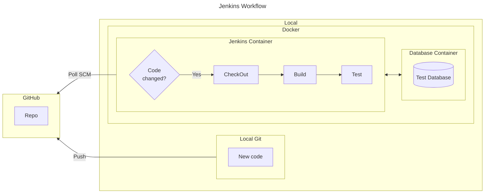
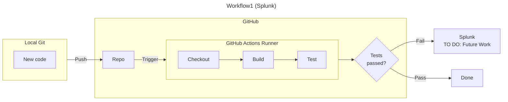
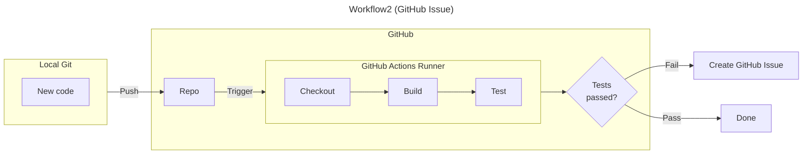
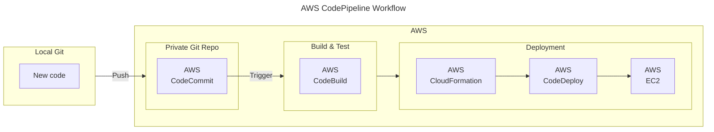

# Highlights

* Developed CI pipelines for automated testing using:
  * [Jenkins](#jenkins---repo-link)
  * [GitHub Actions](#github-action---workflow1-workflow2)
  * [AWS CodePipeline](#aws-cicd-codepipeline)

* Future work to do:
  * Self hosted runner + Anka Virtual Machine
  * Have the web service app containerized, run tests, and upload docker image to Docker Hub.
  * Use Splunk when CI fails.
  * Explore Infrastructure as Code (IaC). It tries to abstract complexities of CI/CD pipelines to make it easier for developers to follow the “You build it, you run it” motto.

## Jenkins - [Repo link](https://github.com/hanjustin/Poll-Web)

* Can have locally running CI pipeline through one command: `docker compose up`
* Fully automated Jenkins configuration, plugin installations, and pipeline setup to eliminate manual steps. Used plugins:
    * [Jenkins Configuration as a Code (JCasC)](https://www.jenkins.io/projects/jcasc/)
    * [Job DSL](https://plugins.jenkins.io/job-dsl/)

### Choices considered & Rationale
* **Jenkins vs Other CI tools**
    - Jenkins seems to the most widely used CI tool.
      - **Double edged sword:**
        - Plugins provide great flexibility & customization, but also makes Jenkins to become **Plugin dependency hell**
* **Manual vs Code configuration**
  - Prioritized code configuration to automate and reduce human error when setting up Jenkins. Most online resources involved manual steps using GUI to configure Jenkins, so trying to achieve 100% configure through code greatly increased LOE.
  - Just like any other automation, tradeoffs were:
      - Very high initial implementation LOE, but very high future productivity.
* **CronJob vs PollSCM vs Webhook**
  - PollSCM had the right balance of LOE & efficiency.
    - **CronJob:**
        - Lowest setup LOE & Lowest efficiency.
        - Starts job even when there is no change.
    - **PollSCM:**
        - Medium setup LOE & High efficiency.
        - Looks for changes before starting to prevent unnecessary work.
    - **Webhook:**  
        - Highest setup LOE & Highest efficiency.
        - GitHub notifies Jenkins in real time whereas Cron & polling runs/checks every X min.

## GitHub Action - [Workflow1](https://github.com/hanjustin/AcronymsWiki), [Workflow2](https://github.com/hanjustin/XCTestMashup)

### Choices considered & Rationale
* **GitHub Action vs GitLab**
  - GitHub seems to be the most popular Git repository hosting platform.

## AWS CI/CD CodePipeline

### Choices considered & Rationale
* **AWS vs Azure vs GCP**
  - AWS seems to be the leading cloud service provider.

## Future Work

* GitHub self hosted runner + macOS Virtual Machine using [Anka](https://veertu.com/anka-build/) or [Apple's Virtualization framework](https://developer.apple.com/documentation/virtualization)
* Explore IaC tools such:
    * Terraform
    * Pulumi

